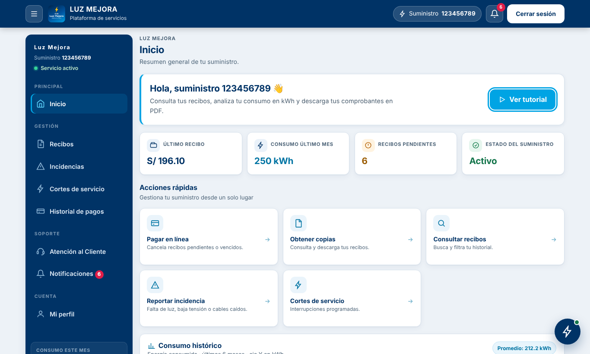
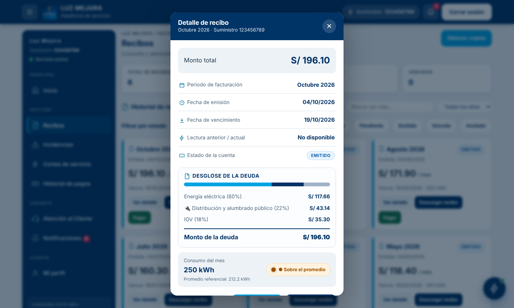
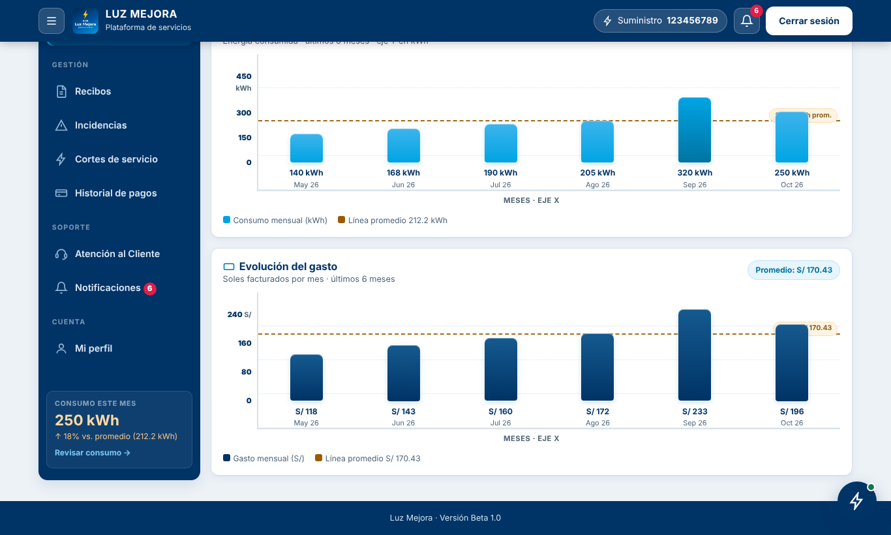
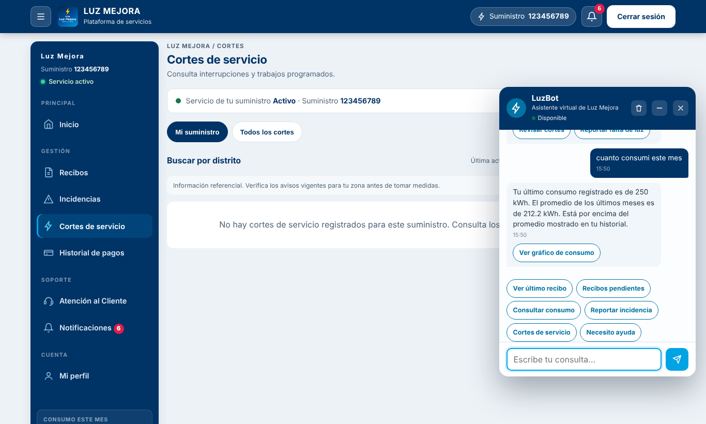

# ⚡ Luz Mejora

**Propuesta de mejora de la experiencia digital de Luz del Sur** — plataforma web donde el cliente ingresa con su número de suministro y gestiona su servicio eléctrico: recibos, consumo en kWh, pagos, incidencias, cortes programados y atención al cliente, con un asistente virtual (**LuzBot**).

> Proyecto académico · Universidad Privada Norbert Wiener · Software I · 2026-II.
> Prototipo demostrativo: los pagos son **simulados**, los datos son de ejemplo y el desglose de la factura es referencial. No representa la tarifa oficial de Luz del Sur ni está afiliado a la empresa.

| Inicio | Detalle de recibo |
|---|---|
|  |  |

| Consumo histórico | LuzBot |
|---|---|
|  |  |

## Funcionalidades

- **Inicio**: resumen del suministro, acciones rápidas y gráficos de consumo (kWh) y gasto (S/) de los últimos 6 meses con línea de promedio.
- **Recibos**: historial con búsqueda por mes y filtros por año/estado; detalle con desglose, semáforo de consumo (Normal / Sobre el promedio / Alto consumo) y descarga en **PDF**.
- **Pago en línea simulado** con código de operación y constancia en PDF.
- **Incidencias**: reporte de falta de luz, baja tensión, cable caído, poste dañado, alumbrado público, etc., con foto y ubicación opcionales.
- **Cortes de servicio**: avisos programados por distrito y por suministro.
- **Notificaciones en tiempo real** (Socket.IO) y **atención al cliente** (solicitudes y reclamos).
- **LuzBot**: asistente local por reglas (sin IA externa) con 20 intenciones: consumo, recibos, pagos, cortes, incidencias, tutorial…
- **Tutorial guiado** de 10 pasos y **panel de administración** (recibos, cortes, incidencias, usuarios, pagos, atención).

## Arquitectura

```
Navegador ──► Nginx (Frontend SPA) ──/api, /socket.io──► Node.js + Express (API REST) ──► PostgreSQL
```

| Capa | Tecnología |
|---|---|
| Frontend | HTML5 + CSS3 + JavaScript vanilla (un solo `index.html`), jsPDF |
| Backend | Node.js 22 · Express 5 · JWT · Socket.IO · helmet · rate-limit |
| Base de datos | PostgreSQL 18 |
| Despliegue | Docker Compose (desarrollo y producción) |

## Ejecutar en local

Requisitos: Docker y Docker Compose.

```bash
git clone https://github.com/skytzwaaa/luz-mejora.git luz-mejora
cd luz-mejora
cp .env.example .env            # valores de prueba, sirven tal cual
docker compose up --build       # → http://localhost:8080
./scripts/seed-demo.sh          # (en otra terminal) carga datos de ejemplo
```

Cuentas de demostración que crea `seed-demo.sh`:

| Rol | Suministro | Clave |
|---|---|---|
| Cliente | `123456789` | `Cliente12345` |
| Administrador | `900000001` | `Admin12345` |

Para apagar: `docker compose down` (añade `-v` para borrar también la base de datos).

## Estructura del repositorio

```
Frontend/                 SPA, Nginx y assets
Backend/                  API REST (server.js) y documentación Java/UML
Base-de-Datos/            init.sql y migraciones
scripts/                  seed-demo.sh, backup-db.sh
docs/capturas/            capturas para la presentación
compose.yaml              desarrollo
compose.prod.yaml         producción (ver DEPLOY.md)
DEPLOY.md                 guía de despliegue en un VPS con HTTPS
AGENTS.md / opencode.json contexto del proyecto para OpenCode
```

## Documentación técnica

- Modelo TO-BE en Java (clases, reglas de negocio, diagrama PlantUML y Javadoc): [`Backend/documentacion/java-docs/`](Backend/documentacion/java-docs/README.md).
- Despliegue en producción: [`DEPLOY.md`](DEPLOY.md).

## Trabajar con OpenCode

El repositorio incluye `AGENTS.md` y `opencode.json`, así que al abrirlo con [OpenCode](https://opencode.ai) el asistente ya conoce la estructura, las convenciones (kWh, suministro de 9 dígitos, idioma español) y cómo levantar el proyecto.

```bash
cd luz-mejora
opencode
```

